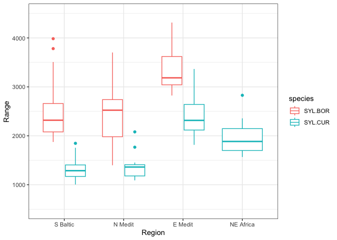
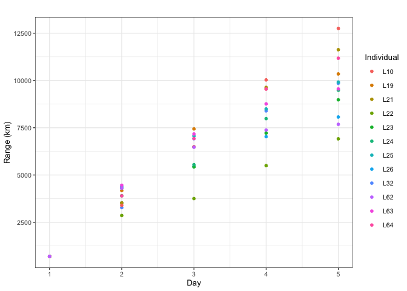

<!-- README.md is generated from README.Rmd. Please edit that file -->

# FlyingR

<!-- badges: start -->

[](https://github.com/BMasinde/FlyingR/actions/workflows/R-CMD-check.yaml)
[](https://ci.appveyor.com/project/BMasinde/FlyingR)
[](https://app.codecov.io/gh/BMasinde/FlyingR)
<!-- badges: end -->

The package provides methods for predicting flight range of birds based
on their physiological characteristics. This is an R implementation of
Flight program provided by Pennycuick.

## Installation

Install the development version from [GitHub](https://github.com/) with:

``` r
# install.packages("devtools")
devtools::install_github("BMasinde/FlyingR")
```

## Time-Marching computation

In brief, the time-marching computation computes the flight range of
birds in short time intervals (6-minutes). Within this time period
chemical and mechanical powers are held constant during which fat and
protein are consumed to sustain flight. Because of the reduction in
weight, the chemical and mechanical powers are recalculated for the next
time period and the distance flown is incremented to previous
time-interval’s distance. And this process iterates until fat mass is
depleted giving the maximum possible range under the time-marching
computation.

## Stop-over mass calculator

Birds migrate long distances between breeding and wintering grounds. In
the majority of cases, it is not possible to cover these distances at a
go, and therefore, stops are required to rest, feed, and restore both
fat and protein Lindström and Piersma 1993; Klaassen 1996; Kaiser 1999;
Schwilch et al. 2002; Pennycuick 2008). However, research on stopovers
(e.g., Lindström 1991; Lindström and Piersma 1993)  
focuses on fuel (fat mass) restoration. As such, the stopover mass
calculator used in the package FlyingR, is based on maximum fuel
deposition rates (FDR), given by Lindström (1991), separately for
passerines and non-passerines (Equations , , and ). This is not an
optimal solution as it does not account for protein restoration. In
addition, there are reservations about using lean body mass; body mass
minus fat mass (Pennycuick 2008).

``` math

    FDR_{max; \ passerines} = 2.22 \times lean \ body \ mass^{-0.27}
    \label{fdr passerines}
```

``` math

    FDR_{max; \ non-passerines} = 2.80 \times lean \ body \ mass^{-0.27}
    \label{fdr nonpasserines}
```

``` math

    fat \ mass \ gained = lean \ body \ mass \times \frac{FDR_{max}}{100} \times duration
    \label{fatmassgained}
```

## Expected variables in datasets

The package looks for columns named *id, name or species.name*,
*bodymass or allupmass*, *wingspan, ws*, *wingarea*, *ordo, order*
(which is a factored column with levels 1 or 2 passerines and
non-passerines respectively) *fatmass, fat.mass, fat_mass* and lastly
*muscle_mass*.

## Examples

### Examples 1: Garden Warbler and Lesser Whitethroat

These two passerine species are trans-Saharan migrants. Lesser
whitethroats winter in the Sahel zone of eastern and north-eastern
Africa (Pearson and Lack 1992), while garden warblers spend winter
further, i.e., in southern Africa (Shirihai, Gargallo, and Helbig 2001).
Data on the Garden Warbler and Lesser Whitethroat are obtained from
various bird ringing stations situated along their SE European flyway
leading from Europe towards African winter quarters. This is split into
four regions: Southern Baltic, Eastern Mediterranean, Northern
Mediterranean and North Eastern Africa. These data include the 1-st year
individuals (immatures): 1,044 garden warblers and 848 lesser
whitethroats, and span the years 2000 to 2006. The sample contains the
following variables: station code, ring number, age, body mass, fat
score, wing and tail measurements. The fat score is used to derive fat
fraction and subsequently fat mass by the procedure described by
Ożarowska (2015). Body mass and fat mass are converted from grams to
kilograms. The wing measurements do not equal the required wingspan as
these are measured differently (i.e., the wingspan is measured from tip
to tip of wings, particularly the primary feathers, in metres). Other
missing variables are the wing area and muscle mass. Bruderer and Boldt
(2001) provide estimates for the wingspan and wing area for several
species. For the Garden Warbler, the wingspan and wing area are 0.223
(m) and 0.0093 ($`m^2`$), respectively. While for the Lesser
Whitethroat, these are 0.185 (m) and 0.0073 ($`m^2`$). Muscle mass
estimates are obtained by using the muscle fraction of 0.17 as
recommended by Pennycuick (2008). Figure presents the flight range
distribution of these two species in kilometres for each region
separately.

``` r
# ------------------------------------------------------------------------------
# A generic function 
# migration function each species at different regions.
# Function returns a list (each species migrated by region)
# ------------------------------------------------------------------------------

region_migrate <- function(data) {
 
  # we need dplyr for filter function
  # we need FlyingR for migration
  require(dplyr)
  require(FlyingR)
  
  # number of regions in dataset
  regions <- unique(data$Region)
    
  # regions data in a list
  region_data <- list()
  
  
  for (i in 1:length(regions)) {
    
    # filter data by region
    filter_data_region <-data %>% filter(Region == regions[i])
    
    # migrate filter data
    user_settings <- list(ipf = 0.9)
    results <- migrate(data = filter_data_region[, 3:9], method = "csw",
                          speed_control = 0, 
                          settings = user_settings,
                          min_energy_protein = 0.05)
    
    region_data[[i]] <- cbind(filter_data_region, "range" = as.vector(results$range))
    
  }
  
  # return region data as a list
  return(region_data)
  
}
```

``` r
# ------------------------------------------------------------------------------
# migrating sylvia borin
# ------------------------------------------------------------------------------
data("garden_wablers")
wablers_migration <- region_migrate(data = garden_wablers)
#> Loading required package: dplyr
#> 
#> Attaching package: 'dplyr'
#> The following object is masked from 'package:testthat':
#> 
#>     matches
#> The following objects are masked from 'package:stats':
#> 
#>     filter, lag
#> The following objects are masked from 'package:base':
#> 
#>     intersect, setdiff, setequal, union
```

``` r
# ------------------------------------------------------------------------------
# migrating Lesser Whitethroats (sylvia curruca)
# ------------------------------------------------------------------------------
data("lesser_whitethroats")
whitethroats_migration <- region_migrate(data = lesser_whitethroats)
```

``` r
# ------------------------------------------------------------------------------
# migration list to one dataframe for Garden Wablers(sylvia_borin) 
# ------------------------------------------------------------------------------
wablers_results <- data.frame()

for (i in 1:length(wablers_migration)) {
  
  wablers_results <- rbind(wablers_results, wablers_migration[[i]])
}

cat("number of rows sylvia borin:", nrow(wablers_results), sep = " ")
#> number of rows sylvia borin: 119
```

``` r
# ------------------------------------------------------------------------------
# migration list to one dataframe for Lesser Whitethroats
# ------------------------------------------------------------------------------

whitethroats_results <- data.frame()

for (i in 1:length(whitethroats_migration)) {
  
  whitethroats_results <- rbind(whitethroats_results, whitethroats_migration[[i]])
}

cat("number of rows in sylvia curruca:", nrow(whitethroats_results), sep = " ")
#> number of rows in sylvia curruca: 84
```

``` r
# ------------------------------------------------------------------------------
# order of region
# rename the regions for clarity
# ------------------------------------------------------------------------------

wablers_results$Region <- factor(wablers_results$Region,
                               levels = c("S Balt", "N Med",
                                          "E Med"), ordered = TRUE)

levels(wablers_results$Region) <- c("S Baltic", "N Medit", 
                           "E Medit")

whitethroats_results$Region <- factor(whitethroats_results$Region,
                                 levels = c("S Balt", "N Med",
                                          "E Med", "NE Afr"), ordered = TRUE)

levels(whitethroats_results$Region) <- c("S Baltic", "N Medit", 
                           "E Medit", "NE Africa")
```

``` r
# ------------------------------------------------------------------------------
# both plots in one
# combine the data sets first
# ------------------------------------------------------------------------------

results <- rbind(wablers_results, whitethroats_results, deparse.level = 0)

# make sure it sums up
nrow(wablers_results) + nrow(whitethroats_results) == nrow(results)
#> [1] TRUE
```

``` r
# ------------------------------------------------------------------------------
# new combined plot
# ------------------------------------------------------------------------------
require(ggplot2)
#> Loading required package: ggplot2
results_combined_plot <- ggplot(results, aes(x = Region, y = range, 
                                             colour = species)) +
  geom_boxplot() +
  #ggtitle("Sylvia curruca flight range by region") +
  theme_bw()+
  labs(y = "Range")+
  ylim(500, 4500)

results_combined_plot
```



Based on these results the two species clearly differ in their potential
flight ranges and therefore show species-specific migration strategy,
when travelling along the same SE flyway, as was described in the
original paper based on Flight (Ożarowska 2015).

### Examples 2: Curlew Sandpiper

The Curlew Sandpiper is a small wader, breeding in Arctic Siberia and
wintering in Africa (Cramp and Simmons 1983). A sample of 12 individuals
was observed over five days in laboratory conditions (in total a sample
of 60 observations) at the University of Gdańsk. Initially, all these
individuals had no subcutaneous fat depots (fat score equal to 0)
(Meissner 2009). Birds were fed ad-libitum with mealworm larvae Tenebrio
molitor. To determine the maximum body mass gain sandpipers were weighed
every day in the morning. The data set consists of body mass, fat mass,
constant wingspan (0.44 m) and wing area (0.018 m2). Body mass and fat
mass are converted from grams to kilograms. On day one, the fat fraction
is assumed to be 0.05 according to the observations of closely related
species - the Red Knot Calidris canutus (Piersma, Bruinzeel, Drent,
Kersten, Van der Meer, and Wiersma 1996). On day 2 the fat fraction
increases on average to 0.23, day 3 – 0.34, day 4 – 0.40 and day 5 –
0.44. Data collected in subsequent days were used to calculate the
potential flight range of the studied individuals each day (Figure 4).
On these data, the constant muscle mass migration simulation is used.
The results return a named vector, if the bird identifier is not unique,
the id suffix is added after an underscore. The results also return the
speed at start and end of migration. All these estimates may be used in
the analyses of inter-individual variation of potential flight range
with increasing fat fraction in migrating birds.

``` r
data("curlew_sandpiper")
```

``` r
# needed data for migration columns 2:9

curlew_range <-
    migrate(
        data = curlew_sandpiper[, 2:9],
        method = "cmm",
        speed_control = 0,
        min_energy_protein = 0.05,
        settings = list(ipf = 0.9)
    )


# Addin computed range to the dataset
curlew_results <- curlew_sandpiper[, 1:2]
curlew_results$range <- as.vector(curlew_range$range)
```

## Visualize the results

``` r
# migrate curlew sandpiper
require(ggplot2)
require(dplyr)

curlew_plot <- ggplot(data = curlew_results)+
  geom_point(aes(x = day, y = range, color = name))+
  theme_bw(base_size = 10)+
  ggtitle("")+
  scale_color_discrete(name = "Individual")+
    xlab("Day")+
    ylab("Range (km)")

curlew_plot
```



### Examples 3: Various bird species data migration

Data *birds* is a preset birds data, extracted from Flight
Pennycuick(2008). Fat mass percentage generated randomly where zero. In
addition, by default muscle mass was derived as 0.17 fraction of the
all-up mass.

## The data

``` r
head(birds)
#>        Scientific.name Empty.mass Wing.span Fat.mass Order Wing.area
#> 1          Anser anser    3.77000     1.600  0.84641     2   0.33100
#> 2 Hydrobates pelagicus    0.02580     0.355  0.00591     2   0.01610
#> 3  Pachyptila desolata    0.15500     0.637  0.03886     2   0.04710
#> 4      Regulus regulus    0.00542     0.156  0.00112     1   0.00525
#> 5     Calidris canutus    0.12700     0.538  0.03500     2   0.03320
#> 6    Aegypius monachus    9.90000     3.040  2.02565     2   1.40000
#>   Muscle.mass
#> 1   0.6409000
#> 2   0.0043860
#> 3   0.0263500
#> 4   0.0009214
#> 5   0.0215900
#> 6   1.6829999
```

``` r
require(FlyingR)
## basic example code

## birds comes with the package
data("birds")

simulation <- migrate(data = birds,  method = "cmm", settings = list(airDensity = 0.905))

simulation$range
#>           Anser anser  Hydrobates pelagicus   Pachyptila desolata 
#>              3537.296              3060.701              4274.620 
#>       Regulus regulus      Calidris canutus     Aegypius monachus 
#>              1264.523              4464.400              3979.271 
#>      Limosa lapponica           Anas crecca       Hirundo rustica 
#>             16652.710              3981.401              3445.013 
#>         Cygnus cygnus          Sylvia borin     Luscinia luscinia 
#>              3489.445              2663.630              2162.845 
#>       Corvus monedula         Anas penelope   Fregata magnificens 
#>              2300.933              6436.829             11904.426 
#>      Larus ridibundus      Diomedea exulans   Phalacrocorax carbo 
#>              6211.954              6271.194              2948.927 
#>       Gyps rueppellii   Torgos tracheliotus         Ardeotis kori 
#>              7867.072              6901.371              4631.958 
#>      Sturnus vulgaris     Fringilla coelebs      Carduelis spinus 
#>              4390.668              2821.588              2625.428 
#>     Turdus philomelos Calidris tenuirostris     Buteo swainsoni M 
#>              3184.748              7060.782              5979.198 
#>     Buteo swainsoni F 
#>              7868.848
```

The function also returns the mechanical and chemical power during the
simulation

### Range estimation based on ODE

This function estimates the range based on Pennycuick (1975) Mechanics
of Flight where Breguet set of equations are used.

``` r
## when estimating range of a single bird
birds_range <- flysim(data = birds,  settings = list(airDensity = 0.905))

birds_range$range
#>           Anser anser  Hydrobates pelagicus   Pachyptila desolata 
#>                3193.8                3252.9                4192.0 
#>       Regulus regulus      Calidris canutus     Aegypius monachus 
#>                1521.6                4240.6                3951.6 
#>      Limosa lapponica           Anas crecca       Hirundo rustica 
#>               11209.3                3797.8                3898.0 
#>         Cygnus cygnus          Sylvia borin     Luscinia luscinia 
#>                3296.0                2801.7                2301.9 
#>       Corvus monedula         Anas penelope   Fregata magnificens 
#>                2452.7                5428.0               10527.4 
#>      Larus ridibundus      Diomedea exulans   Phalacrocorax carbo 
#>                6113.1                5436.8                2918.8 
#>       Gyps rueppellii   Torgos tracheliotus         Ardeotis kori 
#>                6808.3                6334.7                4211.5 
#>      Sturnus vulgaris     Fringilla coelebs      Carduelis spinus 
#>                4197.4                3036.6                2926.6 
#>     Turdus philomelos Calidris tenuirostris     Buteo swainsoni M 
#>                3243.8                6053.5                5671.6 
#>     Buteo swainsoni F 
#>                6994.8
```

## References

Lindström Å, Piersma T (1993). “Mass changes in migrating birds: the
evidence for fat and protein storage re-examined.” Ibis, 135(1), 70–78.
<doi:10.1111/j.1474-919X.1993>. tb02811.x

Klaassen M (1996). “Metabolic constraints on long-distance migration in
birds.” Journal of Experimental Biology, 199(1), 57–64.
<doi:10.1242/jeb.199.1.57>.

Kaiser A (1999). “Stopover strategies in birds: a review of methods for
estimating stopover length.” Bird Study, 46(sup1), S299–S308.
<doi:10.1080/00063659909477257>.

Schwilch R, Grattarola A, Spina F, Jenni L (2002). “Protein loss during
long-distance migra- tory flight in passerine birds: adaptation and
constraint.” Journal of Experimental Biology, 205(5), 687–695.
<doi:10.1242/jeb.205.5.687>.

Pennycuick CJ (2008). MODELLING THE FLYING BIRD, volume 5. First edition
edition. Elsevier, New Jersey.

Lindström Å, Piersma T (1993). “Mass changes in migrating birds: the
evidence for fat and protein storage re-examined.” Ibis, 135(1), 70–78.
<doi:10.1111/j.1474-919X.1993>. tb02811.x.

Pearson DJ, Lack PC (1992). “Migration patterns and habitat use by
passerine and near-passerine migrant birds in eastern Africa.” Ibis,
134(s1), 89–98. <doi:10.1111/j>. 1474-919X.1992.tb04738.x.

Shirihai H, Gargallo G, Helbig AJ (2001). SYLVIA WARBLERS:
IDENTIFICATION, TAX- ONOMY AND PHYLOGENY OF THE GENUS SYLVIA.
Christopher Helm Publishers Ltd.

Ożarowska A (2015). “Contrasting fattening strategies in related
migratory species: the blackcap, garden warbler, common whitethroat and
lesser whitethroat.” Annales Zoologici Fennici, 52(1–2), 115–127.
<doi:10.5735/086.052.0210>.

Bruderer B, Boldt A (2001). “Flight characteristics of birds: I. Radar
measurements of speeds.” Ibis, 143(2), 178–204.
<doi:10.1111/j.1474-919X.2001.tb04475.x>.

Cramp S, Simmons K (1983). HANDBOOK OF THE BIRDS OF EUROPE, THE MIDDLE
EAST AND NORTH AFRICA. THE BIRDS OF THE WESTERN PALEARCTIC: 3. WADERS TO
GULLS. Oxford University Press.

Meissner W (2009). “A classification scheme for scoring subcutaneous fat
depots of shore- birds.” Journal of Field Ornithology, 80(3), 289–296.
<doi:10.1111/j.1557-9263.2009>. 00232.x.

Piersma T, Bruinzeel L, Drent R, Kersten M, Van der Meer J, Wiersma P
(1996). “Vari- ability in basal metabolic rate of a long-distance
migrant shorebird (red knot, Calidris canutus) reflects shifts in organ
sizes.” Physiological Zoology, 69(1), 191–217. doi:
10.1086/physzool.69.1.30164207
